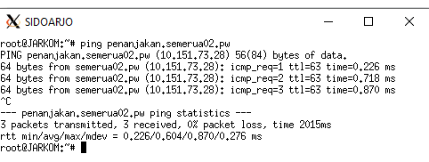

# Jarkom_Modul2_Lapres_A02
Lapres Praktikum Jarkom Modul 2

## Soal 1
Website utama dengan alamat http://semerua02.pw
### Jawab
Mengisi konfigurasi domain pada file /etc/bind/named.conf.local pada MALANG.

~~~
zone "semerua02.pw" {
        type master;
        file "/etc/bind/jarkom/semerua02.pw";
};
~~~
Selanjutnya membuat folder jarkom pada /etc/bind kemudian mengcopy file db.local pada /etc/bind ke /etc/bind/jarkom dengan nama semerua02.pw.
File tersebut diisi sebagai berikut.
~~~
$TTL    604800
@       IN      SOA     semerua02.pw. root.semerua02.pw. (
                        2020111002      ; Serial
                         604800         ; Refresh
                          86400         ; Retry
                        2419200         ; Expire
                         604800 )       ; Negative Cache TTL
;
@       IN      NS      semerua02.pw.
@       IN      A       10.151.73.28 
~~~
Di mana NS adalah adalah Name Server yaitu semerua02.pw dan record A mengarah pada IP PROBOLINGGO.

Kemudian pada server client yaitu GRESIK dan SIDOARJO, ditambahkan
~~~
nameserver 10.151.73.26
~~~
di file /etc/resolv.conf agar server mengarah ke IP MALANG.
Mengecek koneksi DNS dengan melakukan ping semerua02.pw pada GRESIK dan SIDOARJO.

## Soal 2
http://semerua02.pw memiliki alias http://www.semerua02.pw
### Jawab
Menambahkan record CNAME pada file /etc/bind/jarkom/semerua02.pw di MALANG
~~~
www     IN      CNAME   semerua02.pw.
~~~
Mengecek dengan melakukan ping www.semerua02.pw pada GRESIK dan SIDOARJO.

## Soal 3
Membuat subdomain http://penanjakan.semerua02.pw yang DNS-nya diatur pada MALANG dan mengarah ke IP server PROBOLINGGO.
### Jawab
Menambahkan record A yang mengarah pada IP PROBOLINGGO pada file /etc/bind/jarkom/semerua02.pw di MALANG
~~~
penanjakan     IN      A   10.151.73.28
~~~
Mengecek dengan melakukan ping penanjakan.semerua02.pw pada GRESIK dan SIDOARJO.

## Soal 4
Membuat reverse domain untuk domain utama.
### Jawab
Menambahkan konfigurasi di bawah ini ke dalam file /etc/bind/named.conf.local pada MALANG.
~~~
zone "73.151.10.in-addr.arpa" {
    type master;
    file "/etc/bind/jarkom/73.151.10.in-addr.arpa";
};
~~~
Selanjutnya meng-copy file /etc/bind/db.local ke /etc/bind/jarkom/73.151.10.in-addr.arpa lalu mengedit file tersebut menjadi di bawah ini.
~~~
TTL    604800
@       IN      SOA     semerua02.pw. root.semerua02.pw. (
                        2020110903      ; Serial
                         604800         ; Refresh
                          86400         ; Retry
                        2419200         ; Expire
                         604800 )       ; Negative Cache TTL
;
73.151.10.in-addr.arpa. IN      NS      semerua02.pw.
28                      IN      PTR     semerua02.pw
~~~
Record PTR 28 merupakan digit terakhir dari IP PROBOLINGGO.
Mengecek konfigurasi sudah benar atau belum dengan melakukan perintah di bawah ini pada GRESIK
~~~
host -t PTR 10.151.73.28
~~~

## Soal 5
Membuat DNS Server Slave pada MOJOKERTO.
### Jawab
Menambahkan syntax di bawah ini
~~~
notify yes;
also-notify { 10.151.73.27; };
allow-transfer { 10.151.73.27; };
~~~
pada file /etc/bind/named.conf.local pada MALANG.
~~~
zone "semerua02.pw" {
        type master;
        notify yes;
        also-notify { 10.151.73.27; };
        allow-transfer { 10.151.73.27; };
        file "/etc/bind/jarkom/semerua02.pw";
};
~~~
Selanjutnya menambahkan syntax di bawah ini pada file /etc/bind/named.conf.local pada MOJOKERTO.
~~~
zone "semerua02.pw" {
        type slave;
        masters { 10.151.73.26; };
        file "/var/lib/bind/semerua02.pw";
};
~~~
Kemudian pada server client yaitu GRESIK dan SIDOARJO, ditambahkan
~~~
nameserver 10.151.73.27
~~~
di file /etc/resolv.conf agar server mengarah ke IP MOJOKERTO.
Untuk pengecekan, pertama mematikan service bind9 pada server MALANG selanjutnya dilakukan ping semerua02.pw pada client GRESIK.

## Soal 6
Membuat subdomain http://gunung.semerua02.pw yang didelegasikan pada pada server MOJOKERTO dan mengarah pada IP server PROBOLINGGO.
### Jawab
Menambahkan syntax di bawah ini pada file /etc/bind/jarkom/semerua02.pw pada server MALANG.
~~~
ns1     IN      A       10.151.73.27
gunung  IN      NS      ns1
~~~
Sehingga menjadi.
~~~
$TTL    604800
@       IN      SOA     semerua02.pw. root.semerua02.pw. (
                        2020111002      ; Serial
                         604800         ; Refresh
                          86400         ; Retry
                        2419200         ; Expire
                         604800 )       ; Negative Cache TTL
;
@       IN      NS      semerua02.pw.
@       IN      A       10.151.73.28
www     IN      CNAME   semerua02.pw.
penanjakan      IN      A       10.151.73.28
ns1     IN      A       10.151.73.27
gunung  IN      NS      ns1
~~~
Kemudian mengedit file /etc/bind/named.conf.options pada server MALANG dan juga MOJOKERTO dengan menambahkan syntax berikut dan meng-comment baris dnssec-validation auto.
~~~
allow-query{any;};
~~~
Selanjutnya menambahkan syntax di bawah ini pada file /etc/bind/named.conf.local pada MOJOKERTO.
~~~
zone "gunung.semerua02.pw" {
        type master;
        file "/etc/bind/delegasi/gunung.semerua02.pw";
        allow-transfer { any; };
};
~~~
Membuat direktori dengan mana delegasi dalam /etc/bind/ kemudia meng-copy file /etc/bind/db.local ke direktori tersebut dengan nama gunung.semerua02.pw
Selanjutnya mengedit file tersebut menjadi seperti di bawah ini.
~~~
$TTL    604800
@       IN      SOA     gunung.semerua02.pw. root.gunung.semerua02.pw. (
                        2020111001      ; Serial
                         604800         ; Refresh
                          86400         ; Retry
                        2419200         ; Expire
                         604800 )       ; Negative Cache TTL
;
@       IN      NS      gunung.semerua02.pw.
@       IN      A       10.151.73.28
~~~
Mengecek dengan cara melakukan ping gunung.semerua02.pw pada client GRESIK.

## Soal 7
Membuat subdomain http://naik.gunung.semerua02.pw yang diarahkan ke IP PROBOLINGGO.
### Jawab
Menambahkan record A naik yang mengarah ke 10.151.73.28 pada file /etc/bind/delegasi/gunung.semerua02.pw di server MOJOKERTO.
~~~
naik    IN      A       10.151.73.28
~~~
Mengecek dengan cara melakukan ping naik.gunung.semerua02.pw pada client GRESIK.

Untuk soal 8 - 17 semua konfigurasi dilakukan di server PROBOLINGGO.
## Soal 8
Mengatur web server domain http://semerua02.pw
### Jawab
Meng-copy file /etc/apache2/sites-available/default ke /etc/apache2/sites-available/semerua02.pw.
Selanjutnya mengedit file tersebut dengan menambahkan
~~~
ServerName semerua02.pw
ServerAlias www.semerua02.pw
~~~
Serta mengubah DocumentRoot dan Directory menjadi
~~~
DocumentRoot /var/www/semerua02.pw
<Directory /var/www/semerua02.pw>
~~~
Berikutnya, membuat direktori semerua02.pw dalam /var/www/ yang kemudian diisi dengan file-file pendukung untuk web http://semerua02.pw
Terakhir mengaktifkan site semerua02.pw dengan cara menjalankan perintah
~~~
a2ensite semerua02.pw
~~~
pada direktori /etc/apache2/sites-available.

## Soal 9
Mengaktifkan modul rewrite agar url-nya rapi.
### Jawab
Pertama menjalankan perintah
~~~
a2enmod rewrite
~~~
Selanjutnya, membuat file .htaccess pada /var/www/semerua02.pw yang diisi dengan
~~~
RewriteEngine On
RewriteCond %{REQUEST_FILENAME} !-d
RewriteRule ^([^\.]+)$  index.php/$1 [NC,L]
~~~
Kemudian menambahkan syntax berikut pada file /etc/apache2/sites-available/semerua02.pw
~~~
<Directory /var/www/semerua02.pw>
     Options Indexes +FollowSymLinks -Multiviews
     AllowOverride All
</Directory>
~~~

## Soal 10
Mengatur web server http://penanjakan.semerua02.pw
### Jawab
Meng-copy file /etc/apache2/sites-available/semerua02.pw ke /etc/apache2/sites-available/penanjakan.semerua02.pw.
Selanjutnya mengedit file tersebut menjadi
~~~
ServerName penanjakan.semerua02.pw
~~~
Serta mengubah DocumentRoot dan Directory menjadi
~~~
DocumentRoot /var/www/penanjakan.semerua02.pw
<Directory /var/www/penanjakan.semerua02.pw>
~~~
Dan juga menghapus option `Indexes` dalam `<Directory>`. 
Berikutnya, membuat direktori penanjakan.semerua02.pw dalam /var/www/ yang kemudian diisi dengan file-file pendukung untuk web http://penanjakan.semerua02.pw
Terakhir mengaktifkan site penanjakan.semerua02.pw dengan cara menjalankan perintah
~~~
a2ensite penanjakan.semerua02.pw
~~~
pada direktori /etc/apache2/sites-available.

## Soal 11
Hanya bisa melakukan directory listing pada /public.
### Jawab
Menambahkan syntax berikut pada file /etc/apache2/sites-available/penanjakan.semerua02.pw
~~~
<Directory /var/www/penanjakan.semerua02.pw/public>
        Options +Indexes
</Directory>
<Directory ~ "/var/www/penanjakan.semerua02.pw/public/.+">
        Options -Indexes
</Directory>
~~~

## Soal 12
Mengubah error default 404 menjadi file 404.html yang sudah disediakan
### Jawab
Menambahkan syntax berikut pada file /etc/apache2/sites-available/penanjakan.semerua02.pw
~~~
ErrorDocument 404 "/errors/404.html"
~~~

## Soal 13
Dapat mengakses file assets http://penanjakan.semerua02.pw/public/javascripts dengan http://penanjakan.semerua02.pw/js
### Jawab
Menambahkan syntax berikut pada file /etc/apache2/sites-available/penanjakan.semerua02.pw
~~~
Alias "/js" "/var/www/penanjakan.semerua02.pw/public/javascripts"
~~~

## Soal 14
Mengatur web server http://naik.gunung.semerua02.pw yang hanya bisa diakses dengan port 8888.
### Jawab
Meng-copy file /etc/apache2/sites-available/semerua02.pw ke /etc/apache2/sites-available/naik.gunung.semerua02.pw.
Selanjutnya mengedit file tersebut menjadi
~~~
<VirtualHost *:8888>
ServerName naik.gunung.semerua02.pw
~~~
Serta mengubah DocumentRoot dan Directory menjadi
~~~
DocumentRoot /var/www/naik.gunung.semerua02.pw
<Directory /var/www/naik.gunung.semerua02.pw>
~~~
Berikutnya, membuat direktori naik.gunung.semerua02.pw dalam /var/www/ yang kemudian diisi dengan file-file pendukung untuk web http://naik.gunung.semerua02.pw
Langkah berikutnya, menambahkan port yang perlu didengar oleh server dengan cara menambahkan `Listen 8888` pada file /etc/apache2/ports.conf
Terakhir, mengaktifkan site naik.gunung.semerua02.pw dengan cara menjalankan perintah
~~~
a2ensite naik.gunung.semerua02.pw
~~~
pada direktori /etc/apache2/sites-available.
<!--ss-->

## Soal 15
Autentikasi password dengan username=semeru dan password=kuynaikgunung pada web http://naik.gunung.semerua02.pw:8888
### Jawab
Pertama, membuat file .htpasswd pada direktori /etc/apache2 dengan cara menjalankan perintah sebagai berikut.
~~~
htpasswd -c /etc/apache2/.htpasswd semeru
~~~
-c adalah opsi untuk membuat file, dan argumen semeru merupakan entry username.
Setelah menjalankan perintah tersebut, akan diminta muntuk memasukkan password yaitu kuynaikgunung.
Mengecek isi dari file .htpasswd

Selanjutnya, menambahkan syntax berikut pada file /etc/apache2/sites-available/naik.gunung.semerua02.pw
~~~
<Directory /var/www/naik.gunung.semerua02.pw>
        AuthType Basic
        AuthName "Restricted Content"
        AuthUserFile /etc/apache2/.htpasswd
        Require valid-user
        
        ....
</Directory>
~~~
Sebelum login.

Sesudah login

## Soal 16
Setiap mengunjungi IP PROBOLINGGO akan dialihkan secara otomatis ke http://semeruyyy.pw.
### Jawab
Membuat file .htaccess pada direktori /var/www yang berisi syntax berikut.
~~~
RewriteEngine On
RewriteCond %{HTTP_HOST} ^10\.151\.73\.28$
RewriteRule ^(.*)$ http://semerua02.pw/$1 [L,R=301]
~~~

## Soal 17
Karena pengunjung pada /var/www/penanjakan.semeruyyy.pw/public/images sangat banyak maka semua request gambar yang memiliki substring “semeru” akan diarahkan menuju semeru.jpg.
### Jawab
Membuat file .htaccess pada direktori /var/www/penanjakan.semerua02.pw yang berisi syntax berikut.
~~~
RewriteEngine On
RewriteRule public/images/.*semeru*.\.jpg public/images/semeru.jpg
~~~
